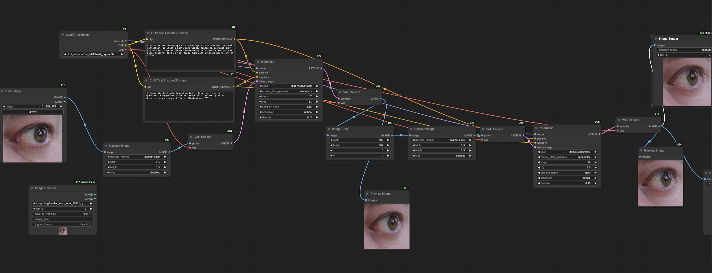
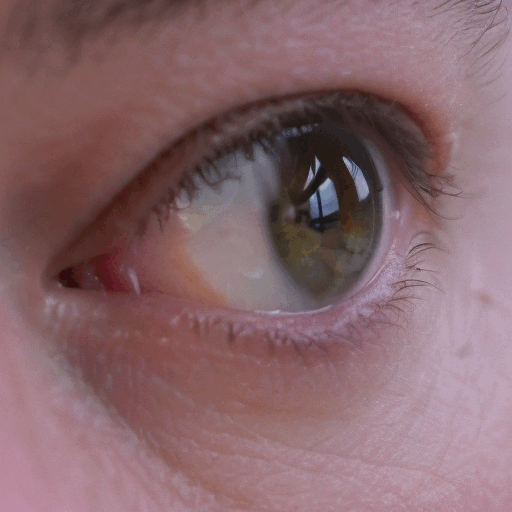
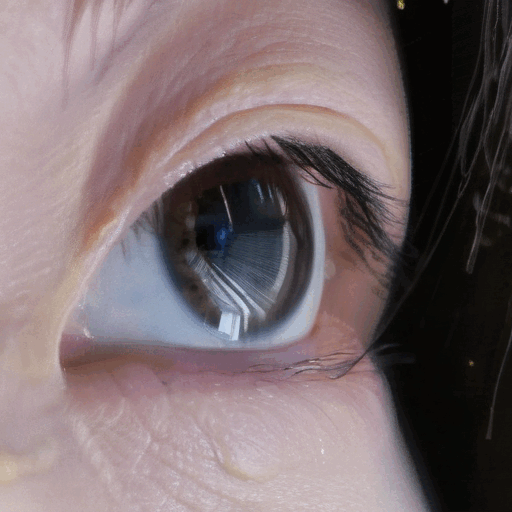

# 

I explored ComfyUI’s strength in image manipulation and generative enhancement to add realism and depth to the reflection, also by zooming in and allowing the AI to dream up what the eye might be seeing - or even metaphorically reflecting.I will prompt ComfyUI to enhance and elaborate on the details within the reflection - essentially asking AI to "imagine" what might be visible in an eye.

I built a self-contained “infinite zoom” loop in ComfyUI:
(thanks to Golan for giving me a good tutorial video for this "infinite zoom")

## How does the workflow work?
1. Loads an initial image into ComfyUI and crops and then later zooms in on its center.

2. Uses a paired ImageSender → ImageReceiver setup to feed each frame’s output back in as the next frame’s input.

3. Applies progressive scaling and prompt-guided denoising on that crop—so each iteration zooms slightly closer while re-rendering details.

4. Loops this process

## Best One I Got

More...

