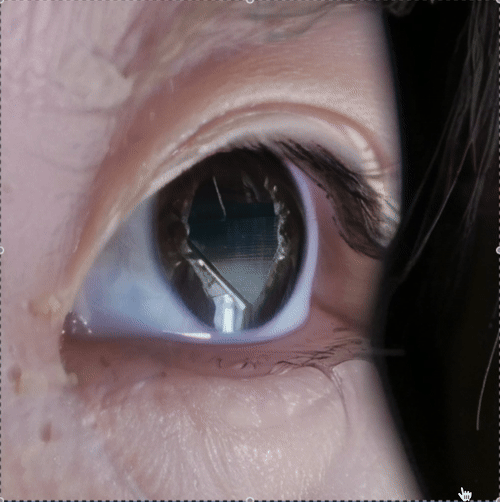
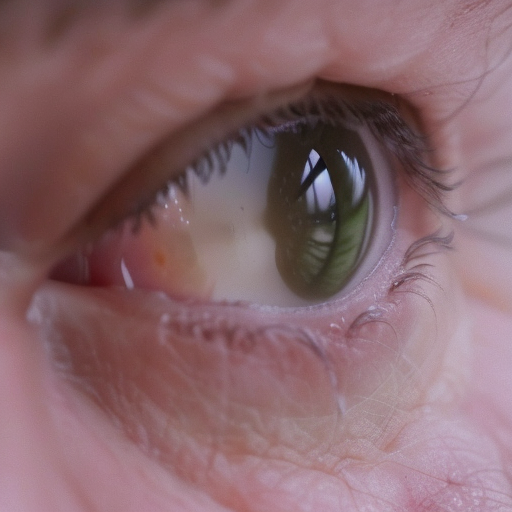

# GEN-AI Final: Reflection of An Eye

I explored ComfyUI’s strength in image manipulation and generative enhancement to add realism and depth to the reflection, also by zooming in and allowing the AI to dream up what the eye might be seeing - or even metaphorically reflecting.I will prompt ComfyUI to enhance and elaborate on the details within the reflection - essentially asking AI to "imagine" what might be visible in an eye.

I built a self-contained “infinite zoom” loop in ComfyUI:
(thanks to Golan for guiding me on the "infinite zoom")

## Workflow
1. Loads an initial image into ComfyUI and crops and then later zooms in on its center.

2. Uses a paired ImageSender → ImageReceiver setup to feed each frame’s output back in as the next frame’s input.

3. Applies progressive scaling and prompt-guided denoising on that crop—so each iteration zooms slightly closer while re-rendering details.

4. Loops this process

## Best One I Got

## Problems
As more iteration goes on, the accumulated details begins to exaggerate, causing them to lose their naturalistic qualities and undermining the fidelity of the original image. The image shifts into an exaggerated, almost cartoonish style: contours grow too bold, contrasts become oversaturated, and the whole scene can feel strangely scary.

- Limit per-step zoom factor: Smaller incremental zooms preserve more original structure and prevent exaggerated detail.

- Lower denoise strength on later iterations: I dropped the denoising strength (e.g. from 0.3 down toward 0.15) on the second or third pass. 

## More...

